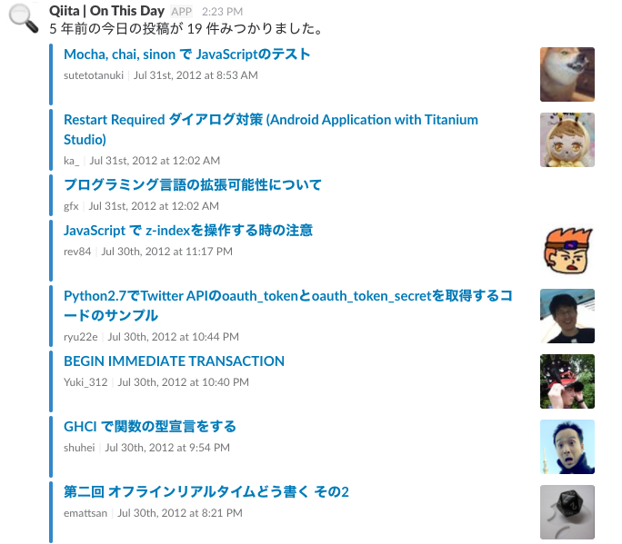

# qiiotd
* Qiita:Team (Qiita) の n 年前の今日の記事を Slack の Incoming webhook へ post するコマンドです。
* Qiita:Team の過去記事を掘り起こすために作成したツールです。
* `qiiotd` = **Qii**ta **O**n **T**his **D**ay.

## インストール
```
$ go get -u github.com/mnkd/qiiotd
```

## ビルド
```
$ make
```

Linux 用にビルドしたい場合は

```
$ make linux
```

## 設定ファイル
* `config.json.sample` を基に `config.json` を作成してください。
* デフォルトのパスは `$HOME/.config/qiiotd/config.json` です。

## 使い方

2 年前の今日の記事を Slack へ投稿する場合。

```
$ qiiotd -ago 2
```

### オプション
```
Usage of ./bin/qiiotd:
  -ago int
    	Years ago (default: 1) (default 1)
  -c string
    	/path/to/config.json (default: $HOME/.config/qiiotd/config.json)
  -days int
    	Days (default: 1) (default 1)
  -v	prints current qiiotd version
```

## 実行例


# 補足 - Qiita API の注意点
## 利用制限
- [Qiita API Doc | 利用制限](http://qiita.com/api/v2/docs#認証中のユーザ)

> 利用制限
> 認証している状態ではユーザごとに1時間に1000回まで、認証していない状態ではIPアドレスごとに1時間に60回までリクエストを受け付けます。

## Qiita:Team のデータを利用する場合
- [Qiita API Doc | 概要](http://qiita.com/api/v2/docs#概要)

> リクエスト
> APIとの全ての通信にはHTTPSプロトコルを利用します。アクセス先のホストには、Qiitaのデータを利用する場合には qiita.com を利用し、Qiita:Teamのデータを利用する場合には *.qiita.com を利用します (*には所属しているTeamのIDが入ります)。
